# project-team-chief
## Members
Aman Riat (300056269)\
Georges Chamoun (300060437)
## Outline

We will be building a sneaker rental application. This application will allow users to rent sneakers. For example, a user can rent Adidas running shoes at a rate of 30$ per day. Users will be able to create accounts and browse for the sneakers they would like to rent. 

Alternatively, users may also use the application to list their own sneakers for rent and have the ability to rent out multiple sneakers at a time. To list a new sneaker, a user simply needs to fill out a form that captures information about the sneaker brand (ex: Adidas), name (ex: NMDs), size, release date, daily rate, and a brief description of the shoe. Users can also upload an image of the sneaker. Once submitted, this sneaker will be available for other users to rent.  

On their profile, users can update their basic information and view all their listings/rentals (if any). Additionally, user can manage their listings/rentals.Furthermore, a user can view all the shoes they are currently renting (borrowing themselves) and opt to release them (give them back). If this is done, that shoe is back on the market.

This project should allow work for a user interface, server, database, and the use of an external API to receive different types of sneakers and images of sneakers. 

## Deliverable 4

### Implementation of features Server / Client / HTML / CSS
Here we have a **[video](https://drive.google.com/file/d/17GxozkmK-tk3znWC_lo5s4K_nuLxUrAC/view?usp=sharing)** that demonstrates our implementation of features through a server, client, html, css, etc. If the video takes too long to load you may also download it. 


Our server is written in node/express and it is further described [here](https://github.com/professor-forward/project-team-chief/blob/f/deliverable4-documentation/README.md#server-technology).  The client which includes the html and css is written in react and more details can be found [here](https://github.com/professor-forward/project-team-chief/blob/f/deliverable4-documentation/README.md#front-end). Additionally we have used an external API to get images and names of sneakers to creat a more responsive website and also reduce the load on our server. The features we implemented through a server, client, etc include:
  * Log In
  * Log Out 
  * Filter Sneakers
  * Create Sneaker Posting
  * Rent Sneaker
  * Search sneakers (type-ahead/autocomplete) 
  * Create Account
  * User view sneaker listing and sneaker rentals 
  * Gallery on landing page 

### Software Documentation (installing, testing and developing the application)
Installation can be found in the [Deployment/Installation section](https://github.com/professor-forward/project-team-chief/blob/f/deliverable4-documentation/README.md#deploymentinstallation). 

Documentation on testing the application can be found [here](https://github.com/professor-forward/project-team-chief/blob/f/deliverable4-documentation/README.md#automated-test-framework)

To develop the application follow the installation steps referenced [here](https://github.com/professor-forward/project-team-chief/blob/f/deliverable4-documentation/README.md#local). From here you will have the appropiate modules installed. Additionally make sure the database is installed and running as described below. Instead of running a build script however you will start the backend and frontend servers. React can be started through going to the `client` folder and running `npm start`. Likewise for the backend folder you will navigate to the `backend` folder and run `npm start`. The react server will run on `localhost:3000` and the server will run on `localhost:3001`.

To populate the database with data you can run the following commands `yarn sequelize-cli db:migrate`, `yarn sequelize-cli db:seed:all`. These were also described below but essentially they populate the web app with mock data. 

The structure for the application is shown below. Only the relevant folders and files are shown. 

For the client side, to add pages, first you must add a component in the components directory and then import that component to the `App.jsx` file. A route must also be added but by navigating through those two main structures, you will be abl

```
Client 
│
└───src
│   │   App.jsx
│   │   App.css
│   │
│   └─── Components
│       │   Card
│       │   CreatePosting
│       │   ...
│   
└─── public
```
The backend is relatively straight forward. App.js is where the node/express server is started wand server.js is where it is ran. The most important file is the index.js file under `/routes` which contains all the key endpoints the frontend needs and what manipulates the database. To edit and add to the backend, this the file that must be modified 

```
backend 
│   app.js
│   server.js 
│   buildScript.js
│
└───database
│   │   config  
│   │   migrations <-- Update tables
│   │   models <-- The tables
|   |   seeders < -- Mock data
│   └───────  
│      
└───routes    
│   │   index.js   <-- All endpoints that the frontend call and where data from the database is retrieved 
│   └───────  
|
.
.
.
```

### Adherance to UI Design System
In general our application closely followed our UI design system. We implemented the chosen colours, fonts, and components and this greatly helped us in development of the frontend. For example the two screenshots below showcase the sneaker card view for our mockup versus our actual react application. The display, colours, and typography are generally the same. Below are more examples comparing our mockups to the actual application. 

Mockup Card           |  React Card
:-------------------------:|:-------------------------:
 |  

Mockup Login          |  React Login
:-------------------------:|:-------------------------:
  | 

Mockup Create Posting             |  React Create Posting
:-------------------------:|:-------------------------:
 |  


### Seeding application with sample data
We seed the application with data on startup. The sample data can be found [here](backend/database/seeders/). The mock data was generated with python scripts and the seeder files load the JSON generated from the python file. The screenshot below shows the mock data with 10 pages worth of sneakers.


### Screenshots of available features
For a better understanding of the application please watch the **[video](https://drive.google.com/file/d/17GxozkmK-tk3znWC_lo5s4K_nuLxUrAC/view?usp=sharing)** where we showcase the app and a simple walkthrough. Here we list screenshots minimally summarizing our features. 

* View all sneakers (generated through mock data)
  * 
* Filter sneakers 
  * 
* View sneaker listing and rent sneakers
  * 
  * 
* Profile and view listing/rentals
  * 
  * 
* Create sneaker posting
  * 
  * 
  * 
  * 

## Deployment/Installation
The app can be deployed through a local route or docker. For ease of use, docker is recommended. In both steps react is bundled into a production build through the `buildScript.js` file meaning that it is minimized to static files. The `node/express` backend serves the static files and also talks to the postgres database. 

### Docker
1. Follow the docker installation [steps](https://docs.docker.com/get-docker/) if not already installed.
2. Navigate to the root directory and run `docker-compose up`.
3. After the docker container is up, head to `localhost:3001` to see the website. 

To populate the database with mock data run the following commands: 
1. Attach a shell to the node/express container with `docker exec -it sneaker-beast bash`
2. First migrate the data `yarn sequelize-cli db:migrate`
3. Second populate the data `yarn sequelize-cli db:seed:all`
4. Refresh the application running at `localhost:3001`

Now the app should be loaded with data and cards of sneakers should appear 

### Local
1. Install [node](https://nodejs.org/en/download/)
2. Install yarn by running `npm install --global yarn`
3. Navigate to the client folder and run `npm install` 
4. Navigate to the backend folder and run `npm install`
5. While in the backend folder, also run `node ./BuildScript.js`
6. Run `npm start` in the backend folder and wait for the application to be ready
7. Visit `localhost:3001` on your browser to the application deployed

Next we will install the database so data can be stored.
1. Download and install [postgres](https://www.postgresql.org/download/)
2. Make sure to select the running port as 5432 
3. From there create a server with the name as `postgres`, host name as `postgres`, and password as `example`
4. Update the `.env` file with the parameters of the postgres database 
5. From here the database should be up

Finally we will populate the data in the database
1. Navigate to the backend folder and frst run `yarn sequelize-cli db:migrate` and then run `yarn sequelize-cli db:seed:all`
2. Data will now be in the database and we can run the app and see cards of sneakers 

### Upgrade Scripts
For upgrade scripts, we utilized [Sequelize](https://sequelize.org/) ORM to assist in creating migration files. Through these files, one can run a simple command in order to create the models/tables in the database. The command is `yarn sequelize-cli db:migrate`. One can create new migration files by using the following command: `yarn sequelize-cli model:generate --name User --attributes firstName:string,lastName:string,email:string` (this also creates a model User and creates an auto-populated migration file for User) or one can create a skeleton migration file using `yarn sequelize-cli migration:generate --name migration-skeleton`. If a model gets updated, one can generate a skeleton migration file and edit it to add the changes made in the model. An example of this can be seen under the `Migration Skeleton` section [here](https://sequelize.org/master/manual/migrations.html). These migration files can be kept and referenced to keep track of all the changes to the models and database. Additionally, one can revert the most recent migration usng `yarn sequelize-cli db:migrate:undo` or you revert to a specific migratin using `yarn sequelize-cli db:migrate:undo:all --to XXXXXXXXXXXXXX-create-posts.js`. 

## General Information 

### Server Technology
Our server is written in javascript using the node/express framework. This can be found in the [backend folder](backend/). Here we handle server side processing and connection to the database in order to store and retrieve data. We also use [sequelize](https://sequelize.org/) in the server to establish a connection with the database as well as handle migrations in order to update the database and populate it with sample data. 

### Database Technology 
The database we use is postgres. We mainly use it through a [docker container](docker-compose.yml) and the server connects to it with the [sequelize](https://sequelize.org/) package. We can also connect to a local pgadmin based instance of postgres through a .env file. The code to connect to the database can be found [here](backend/database).

### Automated Test Framework 
For the backend and frontend we use [jest](https://jestjs.io/). Currently we have tests setup for the frontend located [here](client/src/App.test.js) which now tests the root component. The other tests are located in the components themselves under `client/src/components/`. The backend has tests as well which can be found here [here](backend/app.test.js). These test currently test the API. To run the tests for either the `backend` or `client`, first navigate to the respective directory. Then use the command `npm run test` (this should work for either directory). Make sure the database is up and running and that it is seeded before running the tests.


### Front-end 
We have decided to use react for the frontend and that can be found in the [client folder](client/). The site is interactive and buttons clicks lead to different routes and components. There is also conditional rendering depending on whether a user is logged in or not. Users can browse the application and their actions will lead to responsive messages that confirm their actions. Users can filter for sneakers, rent sneakers, and list sneakers for rent. They can also create accounts and login to save their data.  


## Design System
### Colour Palette
For our colour palette we decided to go with a palette that resembled earthen  tones. These earthen  tones match well with many types of sneakers and gives a sense of 
familiarity to those who often purchase sneakers. The `#F5F1ED` is used as the main background as it is light enough not overpower anything else on the page. This allows us to use the darker earthen  tones on other elements to make them pop. Specifically, we use the `#744253` as buttons on our cards. This contrasts really well with the background colour of the website and the background colour of the cards. The almost black `#252323` is used as background in our headings to properly emphasize different sections within the page. Once again it is a nice contrast with the almost white background. 

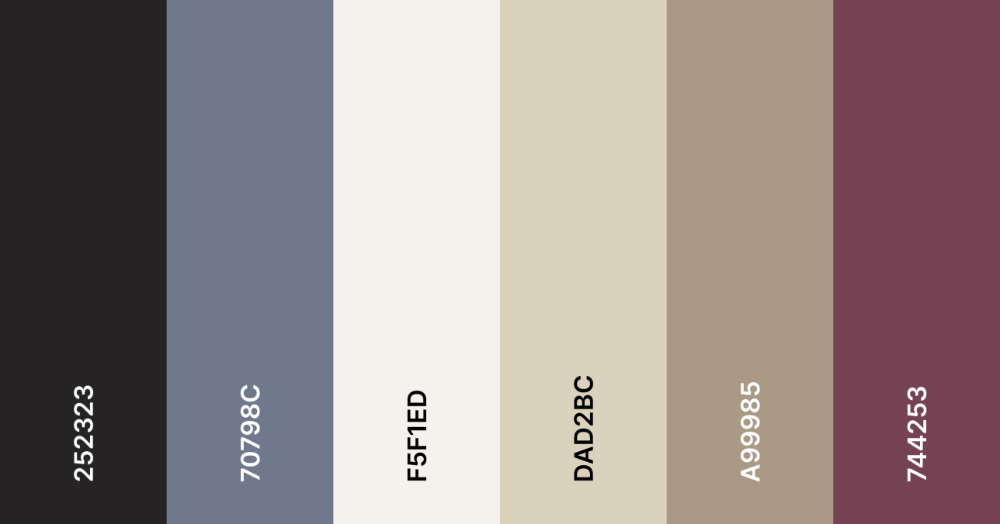


### Fonts and Type Scale
For our fonts we decided on three primary fonts. This decision was taken as to not overload the user and ensure consistency among the website. For headers we decided to use `Marcellus`. It's a serif font that stands out and all headers across the various pages use `Marcellus` as the font (except the navbar). The next font we used was `Raleway`. Raleway is a sans-serif font and is used throughout the website for any body text. Since its sans-serif it doesn't overpower the header and should be easy for the reader to see and digest. The final font we used was courier-new for the navbar. We wanted the navbar to stand out and for that to happen we had to have a different font. `Courier-new` is a really unique font that catches your eye and accomplishes our goals for the navbar. We technically have one more font for the website name which is `Lucida Console`. This is only ever used once and that's for the website name which acts as our logo on the navbar. Below you can see a typography chart to see how the different fonts look.

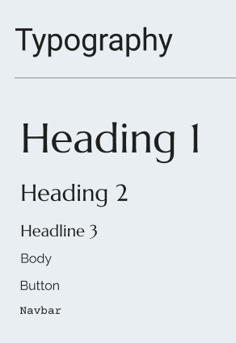

### Icons and Images
We decided to keep it simple with icons and limit our use. Over the course of the project we may add more as we add in details that we hadn't currently thought of. The first icon we used was a magnifying glass to represent a search bar. The second icon we used a person to represent an account tab. These two icons are quite standard throughout the web and both are displayed on the navbar across all pages. The icons also do a hover component to let users know they are clickable and accessible. The final icon we used was a filter icon. This was to help the user easily glance and identify where the filter button is so they can narrow down their search for sneakers. The icons can be found below. 

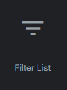 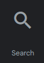 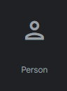

Here are the links to the icons we used:
1. [filter](https://mui.com/components/material-icons/?query=filter&selected=FilterList)
2. [search](https://mui.com/components/material-icons/?query=search&selected=Search)
3. [account](https://mui.com/components/material-icons/?query=person&selected=Person)

As for images we used two basic ones to figure out how pictures of various sneakers would look on the page. The first image is one we would expect a user to see once coming on the page for the first time. For this reason, it is a larger picture and we would like to see it in a gallery. This is shown in `index.html` as the picture has arrows and a marker on the bottom to show that its one of multiple. The second image is a smaller one that we ideally would see on our sneaker cards. It's repeated throughout the mockups for all the cards and has an aspect ratio that we can see fitting in a card. The two images are below.

  
### Buttons 
For buttons we decided on three colours. For the sign up page we went for a standard blue button as this process is quite separate from the main functionality of the rest of the website. For our cards we decided to use the maroon colour as described above (`#744253`). Cards are used a variety of times and these buttons are the most prominent. The maroon colour is easily identifiable and that's why we used it for those buttons. Finally we used the `70789C` for other buttons such as filter since it's not as prominent as the card buttons but are still easily noticeable and different. 

Additionally, for all buttons we added a hover effect that adds shadow to the button to add responsiveness. This way the user knows the site is working and their information will be submitted. The buttons also have padding to appear bigger and once again standout to the user. The three types of button designs can be seen below.

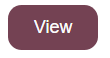 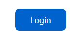 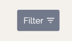

### Forms and Components 
For forms we decided to use cards. Cards separate the form attributes from the rest of the page and emphasize the importance of the fields. The change in background colour, elevation, and shadow behind the card puts it in focus for the user. This way they are drawn to it and can easily fill out the form. The fields themselves do not have labels over but have a grey text within the field to help the user identify what to fill in the particular field. Upon entering a field, there's an autofocus on it so the user knows which field they are currently on. 

For other components, we decided to make components that are reusable and that can be extended to fit various needs. For example, the navbar is one component that we will look to reuse amongst the website with slight modifications depending on the page the user is on. The next component is the sneaker card. Sneakers are the main focus and it is important that the sneaker images and information stay consistent throughout the website. Because of this we designed a separate card that can be reused among the website to display sneakers. A smaller component we designed were the sign up and log in components. They are quite similar in nature but different compared to the rest of the website. Because of this, we designed separate components for them. Below are examples of various components and form elements. 

Form field:
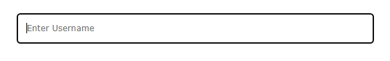 

Login Card:
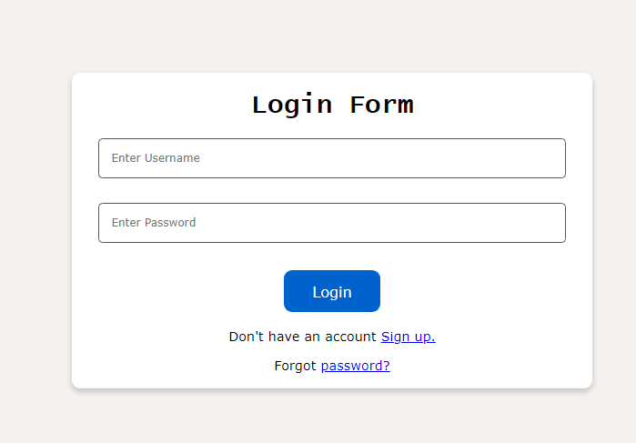 

Navbar:
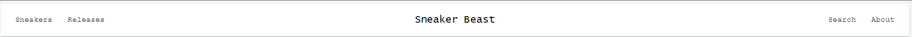 

Sneaker Card:
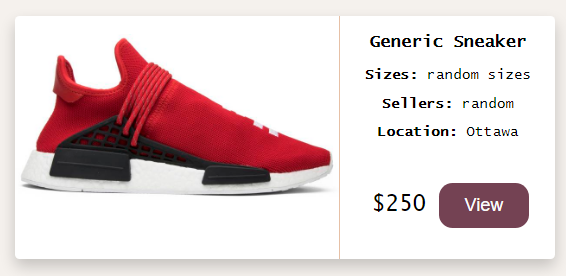 


